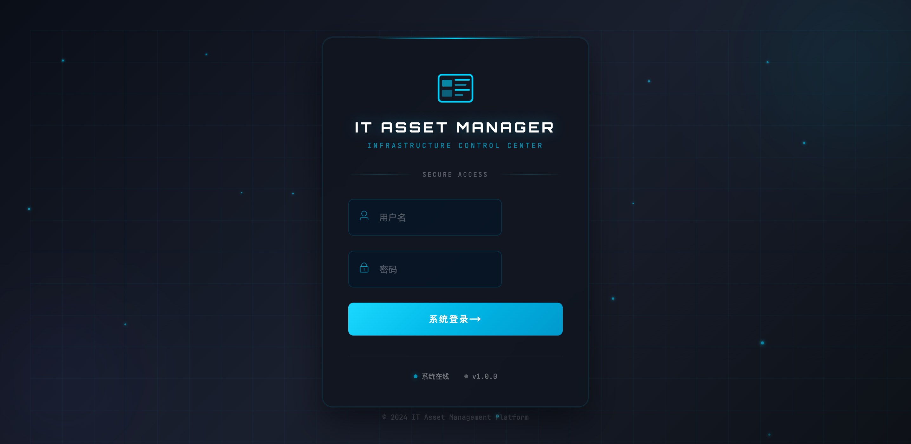
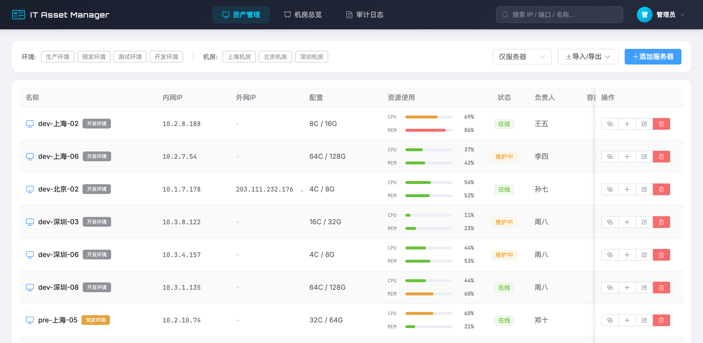
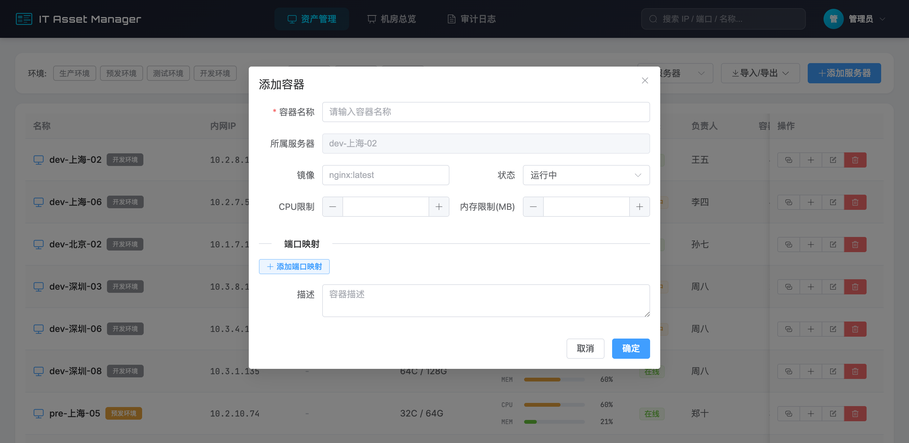
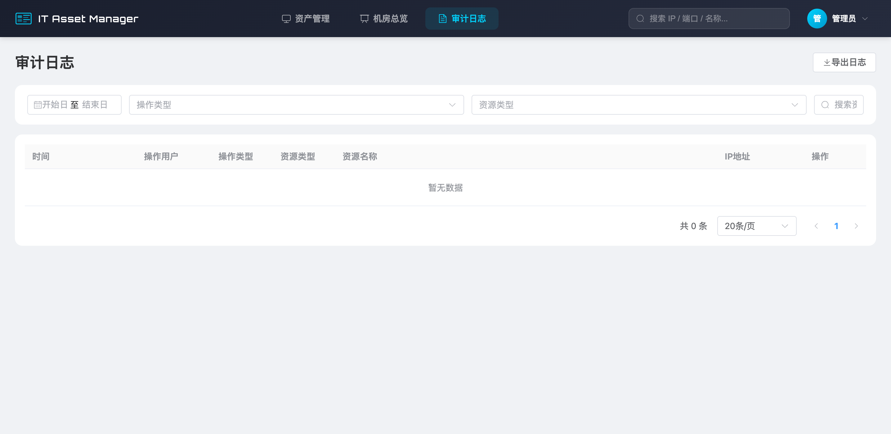

# IT 资产管理平台

一个现代化的IT资产管理系统，用于管理服务器、容器、GPU等IT基础设施资源。

## 功能特性

- 🖥️ **服务器管理** - 多环境、多机房的服务器资源管理
- 📦 **容器管理** - Docker容器的全生命周期管理
- 🎮 **GPU监控** - GPU资源的实时监控和管理
- 🏢 **机房总览** - 可视化展示机房资源分布
- 📊 **资源监控** - CPU、内存、磁盘使用率实时监控
- 🔍 **快速搜索** - 支持IP、端口、名称等多维度搜索

## 功能截图

### 登录界面


### 资产管理


### 容器管理


### 机房总览


## 快速开始

### 环境配置

1. **后端配置**
   ```bash
   cd backend
   cp .env.example .env
   # 编辑 .env 文件，修改敏感信息（SECRET_KEY、JWT_SECRET_KEY、数据库密码等）
   ```

2. **前端配置**
   ```bash
   cd frontend
   npm install
   ```

### 运行项目

**后端：**
```bash
cd backend
python run.py
```

**前端：**
```bash
cd frontend
npm run dev
```

### 默认账号

- 用户名：`admin`
- 密码：`admin123`

## ⚠️ 安全提示

- **切勿**将 `.env` 文件提交到 Git
- **切勿**将敏感密钥上传到公共仓库
- 生产环境必须使用强密码和随机生成的密钥

## 项目结构

```
.
├── backend/          # Flask 后端
│   ├── app/         # 应用主目录
│   ├── .env.example # 环境变量模板
│   └── run.py       # 启动文件
├── frontend/        # Vue.js 前端
│   └── src/         # 源代码
└── screenshots/     # 功能截图
```
